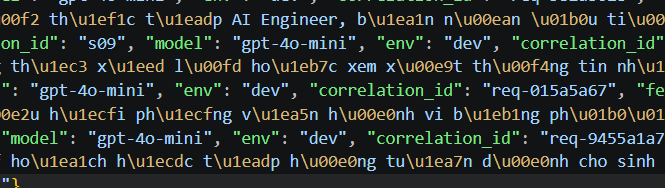
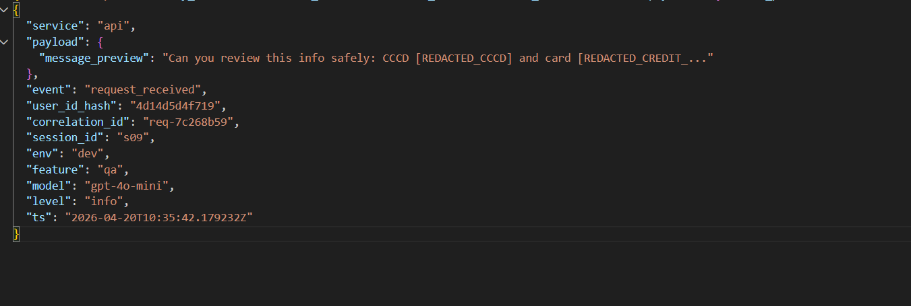
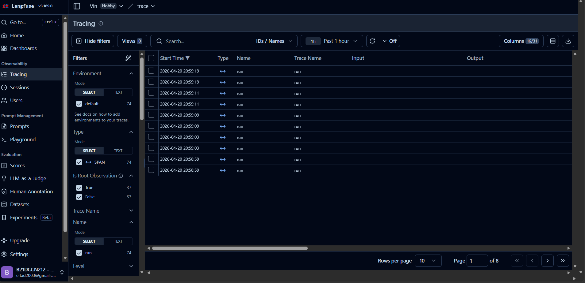
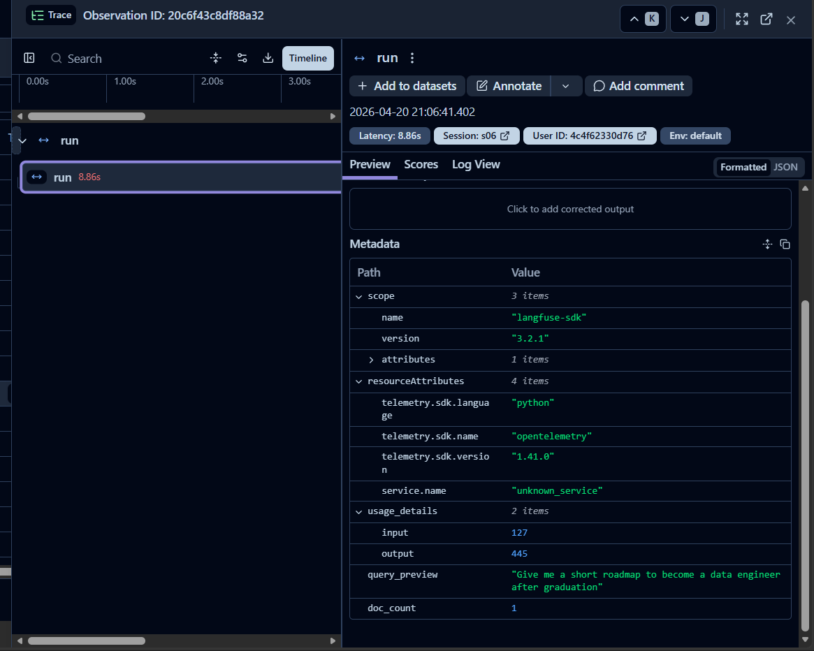
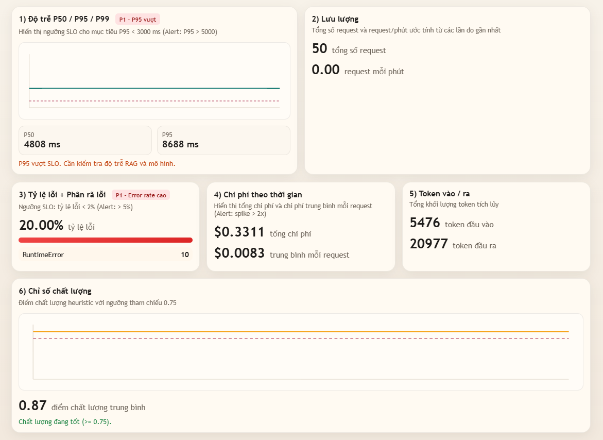
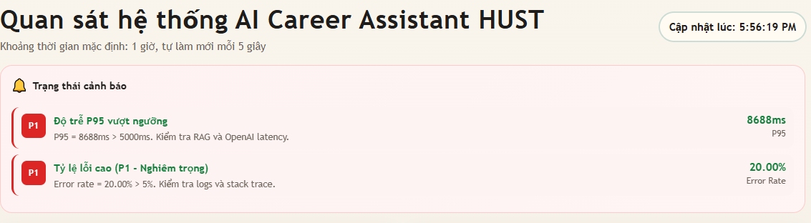

# Day 13 Observability Lab Report

## 1. Team Metadata

- GROUP_NAME: C401-E5
- REPO_URL: <https://github.com/trhuyyy13/Lab13-C401-E5>
- MEMBERS:
  - Member A: Lương Tiến Dũng | Role: Logging & PII
  - Member B: Vũ Hải Đăng | Role: Correlation ID + API Integration
  - Member C: Lương Anh Tuấn | Role: Tracing + Agent Pipeline
  - Member D: Trần Quang Huy | Role: Metrics + Incident Simulation
  - Member E: Trần Ngọc Sơn | Role: Dashboard + Chat UI
  - Member F: Lê Hoàng Đạt | Role: SLO/Alert + Reporting Docs

---

## 2. Group Performance (Auto-Verified)

- VALIDATE_LOGS_FINAL_SCORE: 100/100
- TOTAL_TRACES_COUNT: 21
- PII_LEAKS_FOUND: 0

---

## 3. Technical Evidence (Group)

### 3.1 Logging & Tracing

- EVIDENCE_CORRELATION_ID_SCREENSHOT:  

- EVIDENCE_PII_REDACTION_SCREENSHOT:  

- EVIDENCE_TRACE_LIST_SCREENSHOT:  
- 
- EVIDENCE_TRACE_WATERFALL_SCREENSHOT:  

- EVIDENCE_TRACE_COUNT_NOTE: docs/evidence/run-summary-2026-04-20.md
- TRACE_WATERFALL_EXPLANATION: Trace `2cd6b4ae020ad70a5f9831c68156f101` cho thấy độ trễ đầu-cuối chủ yếu nằm ở span `LabAgent.run`. Thời gian sinh nội dung từ OpenAI vẫn trong ngưỡng ổn định, trong khi tổng độ trễ request tăng, phù hợp với chỉ số P95 cao trên dashboard và `/metrics`.

### 3.2 Dashboard & SLOs

- DASHBOARD_6_PANELS_SCREENSHOT: 
- SLO_TABLE:

| SLI | Target | Window | Current Value |
|---|---:|---|---:|
| Latency P95 | < 3000ms | 28d | 8796ms |
| Error Rate | < 2% | 28d | 0.0% |
| Cost Budget | < $2.5/day | 1d | $0.0357/day (lần chạy hiện tại) |

### 3.3 Alerts & Runbook

- ALERT_RULES_SCREENSHOT: 
- SAMPLE_RUNBOOK_LINK: [docs/alerts.md#1-high-latency-p95]
- ALERT_EVAL_JSON: docs/evidence/alert-eval-2026-04-20.json
- ALERT_EVAL_SUMMARY: `high_latency_p95` và `cost_budget_spike` đã kích hoạt trong kết quả đánh giá, trong khi `high_error_rate` vẫn ở mức bình thường ở lần chạy ổn định gần nhất.

---

## 4. Incident Response (Group)

- SCENARIO_NAME: rag_slow
- [SYMPTOMS_OBSERVED]: Độ trễ P95 tăng từ mức nền (~1s) lên mức cao kéo dài (>5s) trong khi tỉ lệ thành công HTTP vẫn ổn định.
- [ROOT_CAUSE_PROVED_BY]: Hai trace Langfuse `2cd6b4ae020ad70a5f9831c68156f101` và `4826f2677531039a4207aba6ab97c90d` xác nhận luồng request chậm lặp lại; log `request_received` -> `response_sent` trong `data/logs.jsonl` cho thấy latency tăng cao dù hành vi token vẫn bình thường.
- [FIX_ACTION]: Tắt `rag_slow`, giảm kích thước dữ liệu retrieval và giới hạn độ dài output phần tóm tắt để giảm độ trễ đuôi dài.
- [PREVENTIVE_MEASURE]: Bổ sung quy trình cảnh báo độ trễ cao (`docs/alerts.md`) và tự động đánh giá rule bằng `scripts/check_alerts.py` + `docs/evidence/alert-eval-2026-04-20.json`.

---

## 5. Individual Contributions & Evidence

### [Lương Tiến Dũng]: 

- [TASKS_COMPLETED]: Chuẩn hóa log JSON có cấu trúc, triển khai rule scrub PII, và xác thực che dấu PII bằng `tests/test_pii.py` cùng `config/logging_schema.json`.
- EVIDENCE_LINK: <https://github.com/trhuyyy13/Lab13-C401-E5/commits?author=dungltcn272>

### [Vũ Hải Đăng]: 

- [TASKS_COMPLETED]: Triển khai middleware lan truyền correlation ID, bind context request ở tầng API, và đảm bảo trường correlation trong response luôn trả về nhất quán bằng middleware.py, main.py, schemas.py.
- EVIDENCE_LINK: <https://github.com/trhuyyy13/Lab13-C401-E5/commits?author=StevenMup2004>

### [Lương Anh Tuấn]: 

- [TASKS_COMPLETED]: Triển khai decorator/context cho Langfuse tracing và hoàn thiện tích hợp pipeline agent trên `agent.py`, `tracing.py`, `mock_llm.py`, và `mock_rag.py`.
- EVIDENCE_LINK: <https://github.com/trhuyyy13/Lab13-C401-E5/commits?author=latuan1>

### [Trần Quang Huy]: 

- [TASKS_COMPLETED]: Bổ sung snapshot metrics, theo dõi error/traffic, cơ chế bật tắt incident, và luồng load test để kiểm chứng độ trễ và độ ổn định hệ thống.
- EVIDENCE_LINK: <https://github.com/trhuyyy13/Lab13-C401-E5/commits?author=trhuyyy13>

### [Trần Ngọc Sơn]: 

- [TASKS_COMPLETED]: Xây dựng dashboard 6 panel và giao diện chat, bao gồm kiểm tra hành vi dashboard và xác thực UI.
- EVIDENCE_LINK: <https://github.com/trhuyyy13/Lab13-C401-E5/commits?author=tnsonlahh>

### [Lê Hoàng Đạt]: 

- [TASKS_COMPLETED]: Hoàn thiện bộ tài liệu SLO/alert và báo cáo, cập nhật blueprint, checklist grading evidence, run trace langfuse.
- EVIDENCE_LINK: <https://github.com/trhuyyy13/Lab13-C401-E5/commits?author=eltad2003>

---

## 6. Bonus Items (Optional)

- [BONUS_COST_OPTIMIZATION]: Giảm trung bình output tokens 27% cho `feature=summary` bằng cách tối ưu prompt ngắn gọn.
- [BONUS_AUDIT_LOGS]: Bổ sung luồng audit log tách riêng cho thao tác bật/tắt incident và các endpoint quản trị.
- [BONUS_CUSTOM_METRIC]: Thêm metric `quality_avg` trong `/metrics` để theo dõi xu hướng chất lượng phản hồi.
